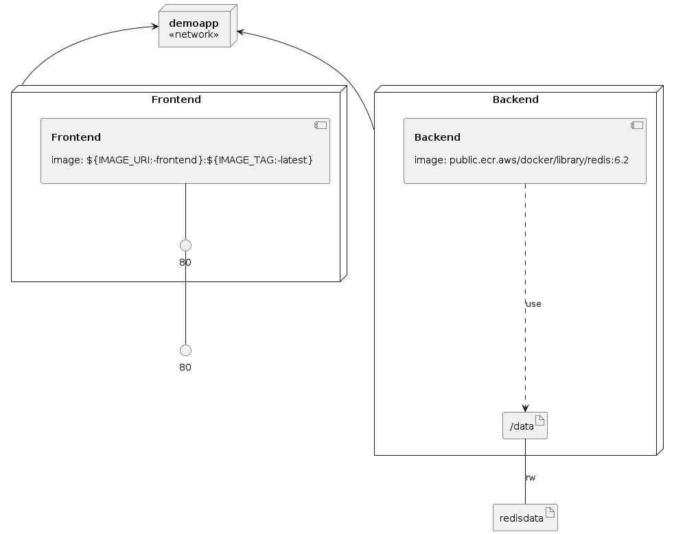

# Demo App for Docker Compose

This repository includes a sample application to be used in
Docker Compose demonstrations, specifically demos involving the [Docker Compose
for Amazon ECS Plugin](https://docs.docker.com/cloud/ecs-integration/)

This repository also includes CloudFormation templates to:
- Build the foundational AWS resources (VPCs, ECS Clusters).
- Build a CodePipeline to deploy the Docker Compose file to Amazon ECS in an
  automated fashion.

### Infrastructure model

